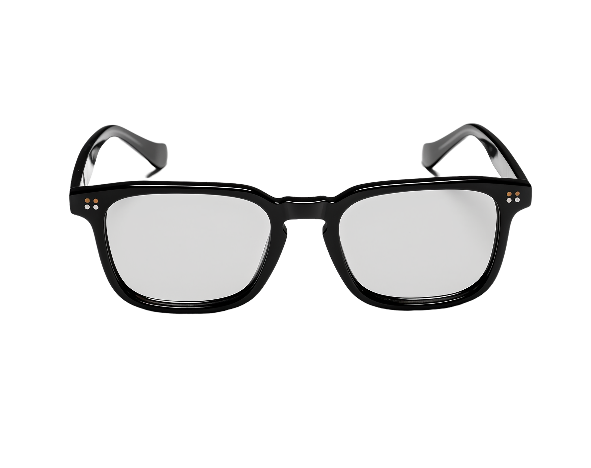

# TryOnGlass 😎

A simple app that virtually puts glasses on users' faces.

## Features
- Overlay virtual glasses on a face image.
- Lightweight and easy to use.
- Works with static images.

## Preview


## Installation
1. Clone the repository:
```bash
git clone https://github.com/AmirSalajegheh/TryOnGlass.git
```
2. Navigate to the project folder:
```bash
cd TryOnGlass
```
3. Install required packages:
```bash
pip install -r requirements.txt
```

## Usage
```bash
python glasses_overlay.py
```
- Follow the on-screen instructions to overlay glasses on an image.

## License
This project is licensed under the MIT License.
